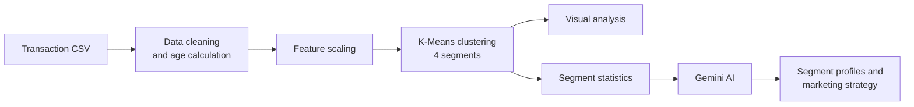

<p align="center">
  
</p>

<h1 align="center">Optomarket</h1>
<p align="center"><em>AI-Driven Customer Segmentation and Analysis Tool</em></p>

---

## About the project

Businesses collect huge amounts of transaction data, but raw transactions don't tell a marketing team *who* their customers are or *how* to reach them. Treating every customer the same wastes budget, and fraud patterns get lost in the noise.

**Optomarket turns raw transaction data into clear customer segments and ready-to-use marketing strategy.** An analyst uploads a transaction file, and Optomarket:

1. cleans and prepares the data,
2. uses machine learning to group customers with similar behaviour into segments,
3. visualizes how those segments differ, and
4. uses Google's Gemini AI to explain each segment in plain business language: who these customers are, how they think, how to market to them and what fraud risks to watch for.

What would normally take a data scientist and a marketing strategist days of work is reduced to a few clicks.

## How it works



### 1. Data preparation
Real-world data is messy. Optomarket fills missing numbers with the median, fills missing categories with the most common value, and calculates each customer's **age at the time of the transaction** from their date of birth.

### 2. Customer segmentation
Customers are clustered with **K-Means** into **4 segments** using four behavioural signals:

| Feature | Why it matters |
|---|---|
| **Transaction amount** | Spending power and purchase size |
| **Age** | Life stage, which drives preferences and channels |
| **Fraud flag** | Separates risky behaviour from normal behaviour |
| **City population** | Urban vs. smaller-town customers |

The features are standardized first so that no single one (like city population, which runs into the lakhs) dominates the clustering.

### 3. Visual analysis
Four charts show what makes each segment distinct:

- **Amount vs. Age scatter plot**: where each segment sits by spending and age
- **Violin plot**: the full spread of transaction amounts per segment
- **Age distribution histogram**: the age makeup of each segment
- **PCA plot**: all features compressed into 2D to show how well-separated the segments are

### 4. AI-generated insights
The statistics for each segment (averages, spreads and sizes) are sent to **Google Gemini**, which writes a report for every segment containing:

- a **professional segment title**
- an **analysis** of its key characteristics
- a **psychological profile** of the typical customer
- **marketing strategies** tailored to that segment
- **targeting and fraud-prevention** recommendations

The segmented data and segment profiles can be downloaded for use in other tools.

## Dataset

The repo includes a sample dataset, **`Augmented_IndiaTransactMultiFacet2024.csv`**: about **10,000 synthetic card transactions** from customers across **28 Indian states**, from April 2022 to April 2024. Each record includes the transaction amount, spending category (entertainment, travel, online shopping, fitness and medical), customer demographics, location and a fraud label.

The data is synthetic, so it contains no real customer or card information. You can upload any CSV with the same columns to analyse your own data.

## Tech stack

| Area | Tools |
|---|---|
| Web app | Streamlit |
| Data processing | pandas, NumPy |
| Machine learning | scikit-learn (K-Means, StandardScaler, PCA) |
| Visualization | Matplotlib, Seaborn |
| Generative AI | Google Gemini API |

## Running it locally

```bash
git clone https://github.com/aniketsahu28m/optomarket.git
cd optomarket
pip install -r requirements.txt
export GEMINI_API_KEY="your-key-here"   # from https://aistudio.google.com/app/apikey
streamlit run app.py
```

Upload the sample CSV from the sidebar, click **Process Data**, and explore the graphs, recommendations and segmented data.
